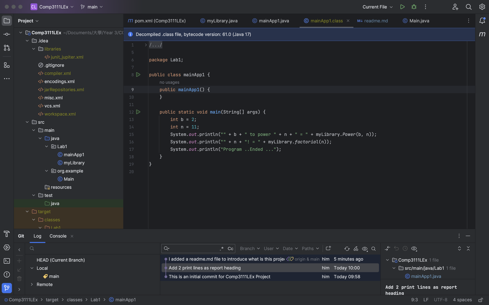

# Comp3111LEx 
Hello! Welcome to the project Comp3111LEx \
Name: Yuen Man Him \
SID: 20864880 \

## This is a Scientific Calculator 
You can try the power and factorial function in myLibrary. \
Feel free to add more function to my calculator. \
Thank you.

# Copy from Appendices
This is my 1st lab in Comp3111 - Software Engineering 

  1. I have learnt the way to build a Java Project in intelliJ;
  2. I have successfully created my first GitHub to share project source with others;

Here's the screenshot of my 1st lab project in intelliJ;

